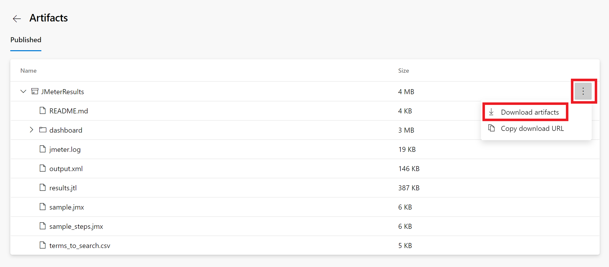
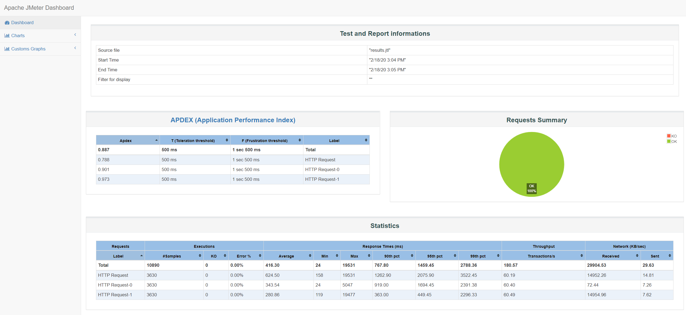

# Load Testing Pipeline with JMeter, ACI and Terraform

This project is a load testing pipeline that leverages [Apache JMeter](https://jmeter.apache.org/) as an open source load and performance testing tool and [Terraform](https://www.terraform.io/) to dynamically provision and destroy the required infrastructure on Azure. 

## Key concepts


The flow is triggered and controlled by an [Azure Pipeline](https://azure.microsoft.com/en-us/services/devops/pipelines/) on [Azure DevOps](https://azure.microsoft.com/en-in/services/devops/). The pipeline contains a set of tasks that are organized logically in `SETUP`, `TEST`, `RESULTS` and `TEARDOWN` groups.

| Task group              | Tasks  |
|-------------------------|--------|
| SETUP | <li>Check if the JMeter Docker image exists</li><li>Validate the JMX file that contains the JMeter test definition</li><li>Upload JMeter JMX file to Azure Storage Account File Share</li><li>Provision the infrastructure with Terraform</li> |
| TEST | <li>Run JMeter test execution and wait for completion</li> |
| RESULTS | <li>Show JMeter master logs</li><li>Get JMeter artifacts (e.g. logs, dashboard)</li><li>Convert JMeter tests result (JTL format) to JUnit format</li><li>Publish JUnit test results to Azure Pipelines</li><li>Publish JMeter artifacts to Azure Pipelines</li> |
| TEARDOWN | <li>Destroy all ephemeral infrastructure with Terraform</li> |

On the `SETUP` phase, JMeter agents are provisioned as [Azure Container Instance (ACI)](https://azure.microsoft.com/en-us/services/container-instances/) using a [custom Docker image](./docker/Dockerfile) on Terraform. Through a [master/slave](https://en.wikipedia.org/wiki/Master/slave_(technology)) approach, JMeter master is responsible to configure all slaves using its own protocol, consolidating all results and generating the resulting artifacts (dashboard, logs, etc).

The infrastructure provisioned by Terraform includes:

* Resource Group
* Virtual Network (VNet)
* Storage Account File Share
* 1 JMeter master on ACI
* N JMeter slaves on ACI

On the `RESULTS` phase, a [JMeter Report Dashboard](https://jmeter.apache.org/usermanual/generating-dashboard.html) and [Tests Results](https://docs.microsoft.com/en-us/azure/devops/pipelines/test/review-continuous-test-results-after-build?view=azure-devops) are published in the end of each load testing execution.

## Repository structure

| Folder    | Description                                    |
|-----------|------------------------------------------------|
| docker    | JMeter custom image                            |
| docs      | Documentation and images                       |
| jmeter    | Contains JMX files used by JMeter agents       |
| pipelines | Docker and JMeter pipeline definitions         |
| scripts   | Scripts that support pipeline execution        |
| terraform | Terraform template for infrastructure creation |

## Prerequisites

* [Azure CLI](https://docs.microsoft.com/en-us/cli/azure/install-azure-cli?view=azure-cli-latest)
* [Azure DevOps CLI](https://docs.microsoft.com/en-us/azure/devops/cli/?view=azure-devops)
* [Service Principal](https://docs.microsoft.com/en-us/cli/azure/create-an-azure-service-principal-azure-cli?view=azure-cli-latest)
* [Azure Container Registry](https://azure.microsoft.com/en-us/services/container-registry/)
* Shell
* [jq](https://stedolan.github.io/jq/download/)

## Getting Started

### 1. Import This Repository

First, you need to login on Azure CLI and configure Azure DevOps CLI with your organization/project settings:

```shell
az login
az devops configure --defaults organization=https://dev.azure.com/your-organization project=YourProject
```

Then, you can create/import this repository on Azure DevOps:

```shell
REPOSITORY_NAME=jmeter-load-test
REPOSITORY_URL=https://github.com/Azure-Samples/jmeter-aci-terraform

az repos create --name $REPOSITORY_NAME
az repos import create --git-source-url $REPOSITORY_URL --repository $REPOSITORY_NAME
```

> You can also use the UI to [import it on Azure DevOps](https://docs.microsoft.com/en-us/azure/devops/repos/git/import-git-repository?view=azure-devops) - As long as you don't forget to fill `$REPOSITORY_NAME` variable with the actual repository name.

### 2. Create Variable Groups

Get you service principal, your ACR credentials, and fill the following empty variables. Then, run this block on Bash:

```shell
CLIENT_ID=
CLIENT_SECRET=
TENANT_ID=
SUBSCRIPTION_ID=
ACR_NAME=
ACR_PASSWORD=
```

Then run the following commands to create the variable groups `JMETER_AZURE_PRINCIPAL` and `JMETER_TERRAFORM_SETTINGS`:

```shell
PRIN_GROUP_ID=$(az pipelines variable-group create  --name JMETER_AZURE_PRINCIPAL --authorize \
                                                    --variables ARM_CLIENT_ID=$ARM_CLIENT_ID \
                                                                ARM_TENANT_ID=$ARM_TENANT_ID \
                                                                ARM_SUBSCRIPTION_ID=$ARM_SUBSCRIPTION_ID \
                                                                | jq .id)

az pipelines variable-group variable create --group-id $PRIN_GROUP_ID --secret true \
                                            --name ARM_CLIENT_SECRET \
                                            --value $ARM_CLIENT_SECRET

SETT_GROUP_ID=$(az pipelines variable-group create  --name JMETER_TERRAFORM_SETTINGS --authorize \
                                                    --variables TF_VAR_JMETER_IMAGE_REGISTRY_NAME=$ACR_NAME \
                                                                TF_VAR_JMETER_IMAGE_REGISTRY_USERNAME=$ACR_NAME \
                                                                TF_VAR_JMETER_IMAGE_REGISTRY_SERVER=$ACR_NAME.azurecr.io \
                                                                TF_VAR_JMETER_DOCKER_IMAGE=$ACR_NAME.azurecr.io/jmeter \
                                                                | jq .id)

az pipelines variable-group variable create --group-id $SETT_GROUP_ID --secret true \
                                            --name TF_VAR_JMETER_IMAGE_REGISTRY_PASSWORD \
                                            --value $ACR_PASSWORD
```

### 3. Create and Run the Docker Pipeline

```shell
PIPELINE_NAME_DOCKER=jmeter-docker-build

az pipelines create --name $PIPELINE_NAME_DOCKER --repository $REPOSITORY_NAME \
    --repository-type tfsgit --branch master \
    --yml-path pipelines/azure-pipelines.docker.yml
```

### 4. Create the JMeter Pipeline

```shell
PIPELINE_NAME_JMETER=jmeter-load-test

az pipelines create --name $PIPELINE_NAME_JMETER --repository $REPOSITORY_NAME \
    --repository-type tfsgit --branch master --skip-first-run \
    --yml-path pipelines/azure-pipelines.load-test.yml

az pipelines variable create --pipeline-name $PIPELINE_NAME_JMETER --name TF_VAR_JMETER_JMX_FILE --allow-override
az pipelines variable create --pipeline-name $PIPELINE_NAME_JMETER --name TF_VAR_JMETER_SLAVES_COUNT --allow-override
```

### 5. Manually Run the JMeter Pipeline

You can choose the JMeter file you want to run (e.g. [jmeter/sample.jmx](./jmeter/sample.jmx)) and how many JMeter slaves you will need for your test. Then you can run the JMeter pipeline using the CLI:

```shell
JMETER_JMX_FILE=sample.jmx
JMETER_SLAVES_COUNT=1

az pipelines run --name $PIPELINE_NAME_JMETER \
    --variables TF_VAR_JMETER_JMX_FILE=$JMETER_JMX_FILE TF_VAR_JMETER_SLAVES_COUNT=$JMETER_SLAVES_COUNT
```

Or even use the UI to define variables and Run the pipeline:


## Viewing Test Results

JMeter test results are created in a [JTL](https://cwiki.apache.org/confluence/display/JMETER/JtlFiles) file (`results.jtl`) with CSV formatting. A [Python script](./scripts/jtl_junit_converter.py) was created to convert JTL to [JUnit format](https://llg.cubic.org/docs/junit/) and used during the pipeline to have full integration with Azure DevOps test visualization.


Error messages generated by JMeter for failed HTTP requests can also be seen on Azure DevOps.


## Viewing Artifacts

Some artifacts are published after the test ends. Some of them are a static JMeter Dashboard, logs and others.



> You can also download these build artifacts using [`az pipelines runs artifact download`](https://docs.microsoft.com/en-us/cli/azure/ext/azure-devops/pipelines/runs/artifact?view=azure-cli-latest#ext-azure-devops-az-pipelines-runs-artifact-download).

After downloading the dashboard and unzipping it, open `dashboard/index.html` on your browser:



## Pipeline Configuration

All Terraform parameters can be configured using the Variable Group `JMETER_TERRAFORM_SETTINGS`. Please read [JMeter Pipeline Settings](./docs/jmeter-pipeline-settings.md) to know more details about it.

## Implementation Notes

This sample only shows how to manually trigger a JMeter Pipeline. You can easily adapt its content and incorporate it on other pipelines, apply continuous integration or other improvements.

This sample uses static JMX files on [jmeter](./jmeter/) directory. You can use many techniques to parameterize JMX files. Some of them are:
* [CSV files](https://guide.blazemeter.com/hc/en-us/articles/206733689-Using-CSV-DATA-SET-CONFIG)
* [Properties](http://jmeter.apache.org/usermanual/functions.html#__P)
* [Environment Variables](https://jmeter-plugins.org/wiki/Functions/#envsupfont-color-gray-size-1-since-1-2-0-font-sup)

Also, you can dynamically generate JMX files from Swagger/Open API using [swagger-codegen](https://github.com/swagger-api/swagger-codegen) or other similar projects.

Current Terraform template creates a new VNET to host JMeter installation. Instead you can modify the template to deploy agents in an existing VNET or your can apply VNET peering to connect them into an existing infrastructure.

## Limitations

* **Load Test duration**
Please note that for [Microsoft hosted agents](https://docs.microsoft.com/en-us/azure/devops/pipelines/agents/hosted?view=azure-devops#capabilities-and-limitations), you can have pipelines that runs up to 1 hour (private project) or 6 hours (public project). You can have your own agents to bypass this limitation.

* **ACI on VNET regions**
Please note that [not all regions](https://docs.microsoft.com/en-us/azure/container-instances/container-instances-vnet#virtual-network-deployment-limitations) currently support ACI and VNET integration. If you need private JMeter agents, you can deploy it in a different region and use VNET peering between them.

## Additional Documentation

* [Adding plugins to JMeter Docker image](./docs/adding-jmeter-plugins.md)
* [JMeter pipeline settings](./docs/jmeter-pipeline-settings.md)

## References

* [User Manual: Remote Testing](https://jmeter.apache.org/usermanual/remote-test.html)
* [User Manual: Apache JMeter Distributed Testing Step-by-step](https://jmeter.apache.org/usermanual/jmeter_distributed_testing_step_by_step.html)
* [Azure DevOps CLI reference](https://docs.microsoft.com/en-us/cli/azure/ext/azure-devops/?view=azure-cli-latest)

## Contributing

This project welcomes contributions and suggestions.  Most contributions require you to agree to a
Contributor License Agreement (CLA) declaring that you have the right to, and actually do, grant us
the rights to use your contribution. For details, visit https://cla.opensource.microsoft.com.

When you submit a pull request, a CLA bot will automatically determine whether you need to provide
a CLA and decorate the PR appropriately (e.g., status check, comment). Simply follow the instructions
provided by the bot. You will only need to do this once across all repos using our CLA.

This project has adopted the [Microsoft Open Source Code of Conduct](https://opensource.microsoft.com/codeofconduct/).
For more information see the [Code of Conduct FAQ](https://opensource.microsoft.com/codeofconduct/faq/) or
contact [opencode@microsoft.com](mailto:opencode@microsoft.com) with any additional questions or comments.
